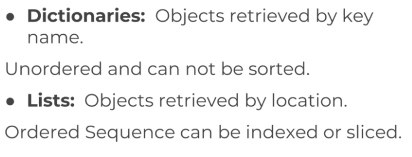

# Python Object and Data Structure basics 


## Python Data Types


## Python numbers

There are two main number types:
1. Integers which are whole numbers.
2. Floating point numbers which are numbers with a decimal

## variable assignment


***Python uses Dynamic typing, this means we can reassign variables to different data types.***

this is OK in Python
```
my_dogs = 2
my_dogs = ["Sammy", "Franky"]
```


## Strings

Strings are sequences of characters, using the syntax of either single quotes or double quotes
1. 'hello'
2. "Hello"
3. "I don't do that"

Because strings are ordered sequences, it means we can use indexing and slicing to grab sub-sections of the string.

## Indexing and slicing with strings


```
mystring = "Hello World"
mystring[2]
mystring[-3]

mystring[2:]  # 'llo World'
mystring[:3]  # 'Hel'
mystring[1:4] # 'ell'
mystring[::2] # 'HloWrd'
```

## String Properties and Methods


### Immutability
To change name "Sam" to "Pam", we cannot do name[0] = 'P'

```
name = 'Sam'
last_letter = name[1:]
name = 'P' + last_letter
```

### Methods

```
mystring.upper()
mystring.lower()
mystring.split()
mystring.split('i')

```

## Print formatting with Strings

### Formatting with the .format() method

```
print('The {} {} {}'.format('fox', 'brown', 'quick'))

print('The {0} {1} {2}'.format('fox', 'brown', 'quick'))

print('The {q} {b} {f}'.format(f='fox', b='brown', q='quick'))
```

### Float formatting follows "{value:width.precision f}"
```
result = 100/777
print("The result was {r}".format(r = result))
print("The result was {r:1.3f}".format(r = result))
```

### f- strings (formatted string literals)
```
name = "Jose"
print("Hello, his name is {}".format(name))
print(f"Hello, his name is {name}") # Python new version
```

## Lists in Python

```
my_list = [1,2,3]
my_list = ["hi", 1, 4.5, "one"]
len(my_list)
my_list[1] = "there"

mylist = ['one', 'two', 'three']
another_list = ['four', 'five']
new_list = mylist + another_list
new_list.append('six')

new_list.pop() # pop the last item
item = new_list.pop()
new_list.pop(1) # index

new_list = ['e','a','x','g','s']
num_list = [5,2,0,9]

new_list.sort()
num_list.sort()
my_sorted_list = new_list

new_list.reverse()
```

## Dictionaries in Python

{'key1':'value1', 'key2': value2'}

When to choose a list and when to choose a dictionary

