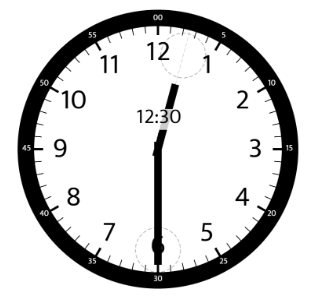

## Subsets (Medium)

Given a set of distinct integers, nums, return all possible subsets (the power set).

Note: The solution set must not contain duplicate subsets.

Example:

```
Input: nums = [1,2,3]
Output:
[
  [3],
  [1],
  [2],
  [1,2,3],
  [1,3],
  [2,3],
  [1,2],
  []
]
```

```
public class Solution {
    public IList<IList<int>> Subsets(int[] nums) {
        
        IList<IList<int>> result = new List<IList<int>>();
        Array.Sort(nums);
        backTrack(result, new List<int>(), nums, 0);
        return result;
    }
    
    public void backTrack(IList<IList<int>> result, IList<int> list, int[] nums, int start) {
        result.Add(new List<int>(list));
        for(int i = start; i < nums.Length; i++) {
            list.Add(nums[i]);
            backTrack(result, list, nums, i+1);
            list.RemoveAt(list.Count -1);
        }
    }
}
```
